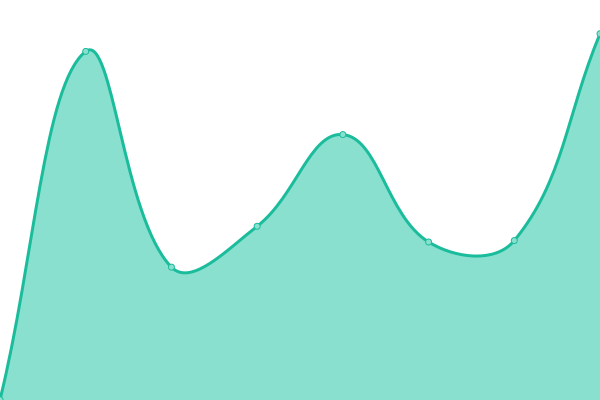
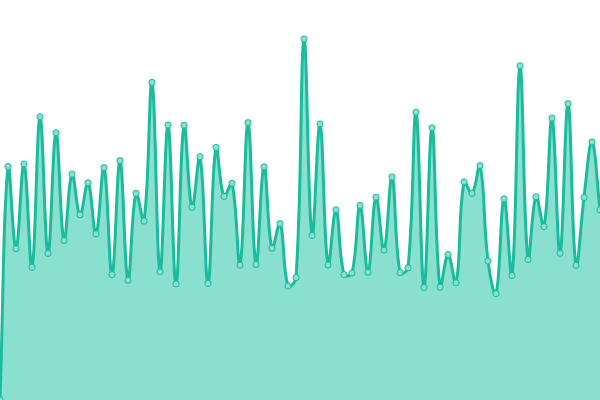
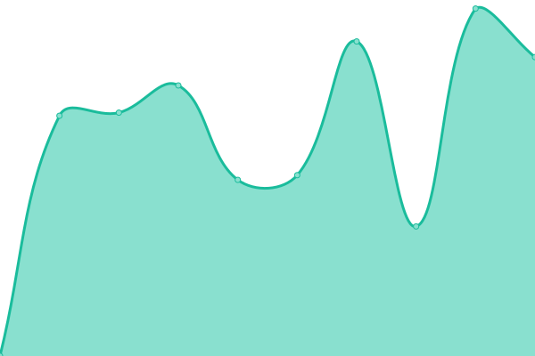
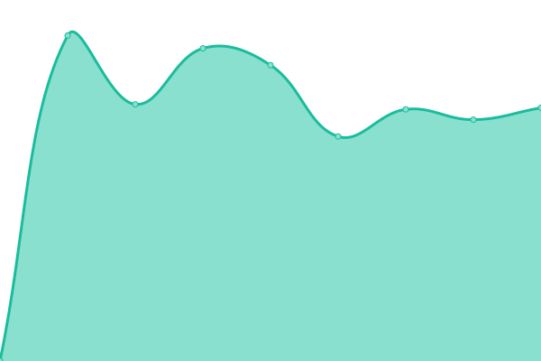

# [📈 Live Status](https://keywordnew.github.io/vantaa-watchtower): <!--live status--> **🟧 Partial outage**

This repository contains the open-source uptime monitor and status page for [Manil Chowdhury](https://manil.xyz), powered by [Upptime](https://github.com/upptime/upptime).

With [Upptime](https://upptime.js.org), you can get your own unlimited and free uptime monitor and status page, powered entirely by a GitHub repository. We use [Issues](https://github.com/keywordnew/vantaa-watchtower/issues) as incident reports, [Actions](https://github.com/keywordnew/vantaa-watchtower/actions) as uptime monitors, and [Pages](https://keywordnew.github.io/vantaa-watchtower) for the status page.

<!--start: status pages-->
<!-- This summary is generated by Upptime (https://github.com/upptime/upptime) -->
<!-- Do not edit this manually, your changes will be overwritten -->
<!-- prettier-ignore -->
| URL | Status | History | Response Time | Uptime |
| --- | ------ | ------- | ------------- | ------ |
|  [Helsinki Region Environmental Services HSY](https://www.hsy.fi/en/water-and-sewers/water-supply-cuts-and-disturbances-in-water-supply/) | 🟩 Up | [helsinki-region-environmental-services-hsy.yml](https://github.com/neighbourhood-cyber/vantaa-watchtower/commits/HEAD/history/helsinki-region-environmental-services-hsy.yml) | 

 737ms
     
 | 

<a href="https://keywordnew.github.io/vantaa-watchtower/history/helsinki-region-environmental-services-hsy">100.00%</a>
    

|  [Helen Oy](https://www.helen.fi/en) | 🟩 Up | [helen-oy.yml](https://github.com/neighbourhood-cyber/vantaa-watchtower/commits/HEAD/history/helen-oy.yml) | 

 659ms
     
 | 

<a href="https://keywordnew.github.io/vantaa-watchtower/history/helen-oy">100.00%</a>
    

|  [DNA Oyj](https://www.dna.fi/) | 🟥 Down | [dna-oyj.yml](https://github.com/neighbourhood-cyber/vantaa-watchtower/commits/HEAD/history/dna-oyj.yml) | 

 958ms
     
 | 

<a href="https://keywordnew.github.io/vantaa-watchtower/history/dna-oyj">43.70%</a>
    

|  [Helsingin ja Uudenmaan sairaanhoitopiiri](https://www.hus.fi/potilaalle/sairaalat-ja-toimipisteet/paivystysapu-116117) | 🟩 Up | [helsingin-ja-uudenmaan-sairaanhoitopiiri.yml](https://github.com/neighbourhood-cyber/vantaa-watchtower/commits/HEAD/history/helsingin-ja-uudenmaan-sairaanhoitopiiri.yml) | 

 1480ms
     
 | 

<a href="https://keywordnew.github.io/vantaa-watchtower/history/helsingin-ja-uudenmaan-sairaanhoitopiiri">98.52%</a>
    

|  [Western Uusimaa Police Department](https://poliisi.fi/tee-rikosilmoitus) | 🟩 Up | [western-uusimaa-police-department.yml](https://github.com/neighbourhood-cyber/vantaa-watchtower/commits/HEAD/history/western-uusimaa-police-department.yml) | 

 968ms
     
 | 

<a href="https://keywordnew.github.io/vantaa-watchtower/history/western-uusimaa-police-department">100.00%</a>
    

|  [Helsinki Regional Transport Authority](https://www.hsl.fi/) | 🟥 Down | [helsinki-regional-transport-authority.yml](https://github.com/neighbourhood-cyber/vantaa-watchtower/commits/HEAD/history/helsinki-regional-transport-authority.yml) | 

 416ms
     
 | 

<a href="https://keywordnew.github.io/vantaa-watchtower/history/helsinki-regional-transport-authority">0.00%</a>
    

|  [OP Financial Group](https://www.op.fi/home-page) | 🟩 Up | [op-financial-group.yml](https://github.com/neighbourhood-cyber/vantaa-watchtower/commits/HEAD/history/op-financial-group.yml) | 

 1589ms
     
 | 

<a href="https://keywordnew.github.io/vantaa-watchtower/history/op-financial-group">99.38%</a>
    

<!--end: status pages-->

[**Visit our status website →**](https://keywordnew.github.io/vantaa-watchtower)

## 📄 License

- Powered by: [Upptime](https://github.com/upptime/upptime)
- Code: [MIT](./LICENSE) © [Manil Chowdhury](https://manil.xyz)
- Data in the `./history` directory: [Open Database License](https://opendatacommons.org/licenses/odbl/1-0/)
